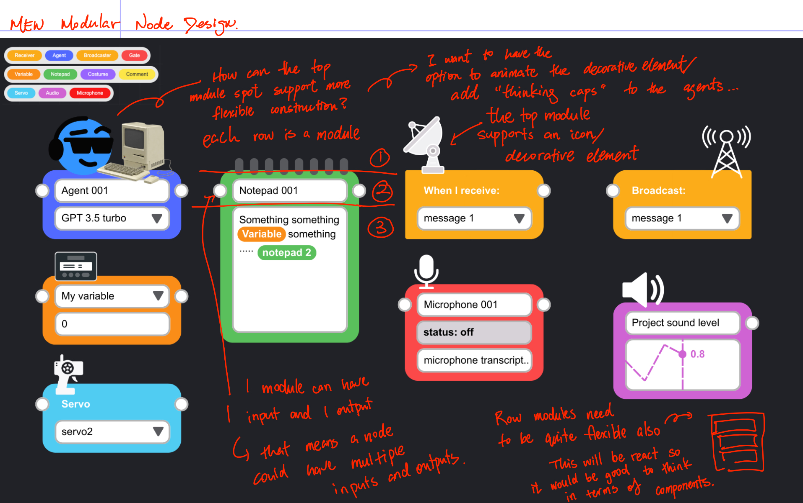

# Node architecture and design | MEW v0.2

Node component structure:
```
Node container
- row module
- row module
```
Each node is made up of multiple row modules. Row modules are defined separately as their own smaller components for better maintainability.

Nodes are defined as a composite of row module components



Where should the function code for the row modules be?

Use a hybrid approach:
- **Simple, UI-specific logic** (e.g. toggle state, focus management) lives inside the row module component.
- **Reusable logic** (e.g. validation, data transformation, port connections) is extracted into custom hooks or utility functions in a `hooks/` or `utils/` directory.
- **Complex state management** for a row module should be extracted into its own custom hook (e.g. `useTextFieldWithTiles`).

This keeps code discoverable and focused while avoiding duplication and maintaining testability.

Structure example:
```
row-modules/
  ├── TextInputRow.jsx
  ├── DropdownRow.jsx
  ├── hooks/
  │   ├── useInputValidation.js
  │   ├── usePortConnection.js
  │   └── useTextFieldWithTiles.js
```

Defining a row module
- is a react component that renders one horizontal stripe of a node
- can have an input and output port that can be individually activated/deactivated
- row modules can be reused in different nodes
- data can be editable or read only
    - editable examples:
        - text field
        - dropdown
        - text field with drag and drop "tiles" for where the input values are going to be inserted
    - read only examples:
        - text label
        - decorative image/icon
        - status indicator
        - bar chart / graphing tool

Types of nodes:
- agent
- notepad
- variable
- receiver
- broadcaster
- comment
- microphone
- audio
- servo

# Process for updating new nodes or modules

## New modules

1. **Add the component.**  
   * Create a new file in `src/components/mew-tab/row-modules/`, e.g.
     `MyFancyRow.jsx`.  
   * Keep logic that is specific to this UI here; pull shared logic into a
     hook or util in `row-modules/hooks` or `row-modules/utils`.

2. **Register it.**  
   * Import and add it to `row-modules/rowModuleRegistry.js` under a unique
     string key (the “type” you will use in definitions).
   * Optionally export a helper from the registry if you prefer.

3. **Document.**  
   * Update this README with a brief description of the new module (its
     purpose, props, ports, etc.).
   * Add any special instructions for using it.


## New nodes

1. **Add a definition to the catalog.**  
   * Open `src/components/mew-tab/nodeCatalog.js` and add a new entry under
     `NODE_DEFINITIONS`.  
   * A node is simply an array of `{ id?, type, props }` objects referencing
     registered row modules.

2. **Test the rendering.**  
   * Drag the new node from the toolbox or drop it onto the workbench; verify
     the correct modules appear and that any interactive rows behave as
     expected.

3. **(Optional) add logic.**  
   * If the node needs its own behaviour you can pass callbacks through the
     `Node` wrapper or provide a custom wrapper component that renders a
     `<Node>` with additional handlers.

4. **Document.**  
   * Add the node name and a short description to this README.
   * Mention any required modules or special configuration.

Because nodes are defined declaratively the toolbox/business‑logic code never
needs to change; new node types “just work” once the catalog entry exists.

# Row modules and usage examples

- title row  
    – read‑only header  
    – example usage in nodeCatalog:
    ```js
      { id: 'title', type: 'title', props: { text: 'My node' } }
    ```

- text‑input row  
    – editable text box with optional label/placeholder, calls `onChange` when the value changes  
    – example usage:
    ```js
      {
        id: 'name',
        type: 'textInput',
        props: { label: 'Name', placeholder: 'Agent name' }
      }
    ```

- dropdown row  
    – select control; supply `options` array, optional `label`/`placeholder`; value changes are sent via `onChange`  
    – example usage:
    ```js
      {
        id: 'mode',
        type: 'dropdown',
        props: {
          label: 'Mode',
          options: [
            { value: 'audio', label: 'Audio' },
            { value: 'text',  label: 'Text' }
          ],
          placeholder: 'Choose a mode'
        }
      }
    ```


# workbench

## Defining the source-of-truth graph state

```json
{
  "nodes": [
    {
      "id": "n1",
      "type": "agent",
      "x": 120,
      "y": 80,
      "inputs": {
        "in_text": []
      },
      "outputs": {
        "out_text": [
          { "nodeId": "n2", "portId": "in_text" } // portIds should be unique per node
        ]
      },
      "data": {}
    }
  ],
  "viewport": { "panX": 0, "panY": 0, "zoom": 1 },
  "meta": { "version": 1, "updatedAt": "2026-03-16T00:00:00.000Z" }
}
```

Notes:
- `edges` are **derived** from `nodes[].outputs`.
- Connection endpoint format is `{ nodeId, portId }` (not nodeId alone).
- `outputs` is the write-source for connections; `inputs` may be derived/validated.